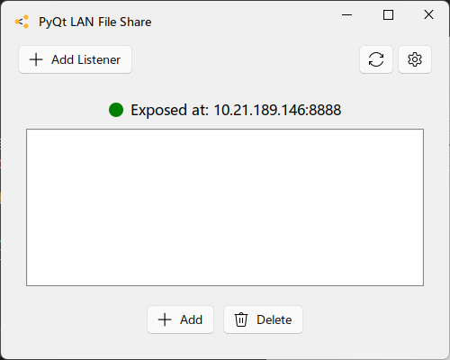

## PyQt5-LAN-File-Share

本程序是华中科技大学2023学年**陈建文老师的Python公选课**结课作业，选题为*C9: 使用GUI共享文件*。

个人觉得这个项目非常适合拿来做第一个PyQt5的练手项目 ~~虽然因为赶工我的写法并不是很规范~~

> 作者：ChlorineC @ HUST CS, 2023
> 
> 作业仅供参考，鼓励独立思考。如果你有任何疑问欢迎联系我：462241980@qq.com

### 技术实现

本程序采用Python内建的 `http` 库，基于HTTP和TCP实现实现目录映射和文件发送，具体方案为：

- 在本地维护一个 `./shared` 目录，默认在这个目录建立HTTP服务器
- 局域网内其他机器访问指定IP地址+端口，获取目录的HTML并交由 `BeautifulSoup` 和 `lxml` 解析出文件名和链接
- 根据解析出的信息在本地渲染出列表，并根据用户输入再次发送HTTP请求（需要注意区分目录请求和文件请求）
- 界面渲染采用 [PyQt5](https://pypi.org/project/PyQt5/) 和 [PyQt-Fluent-Widgets](https://github.com/zhiyiYo/PyQt-Fluent-Widgets) 进行绘制

### 如何运行项目

如果你不想探究源码的话，最好的方法是直接通过 [Release](https://github.com/KiritoKing/HUST-Python/releases) 下载独立EXE运行（暂未编译*nix系统版本）

如果你想下载源码自己运行和编译，本项目需要的所有依赖均存储在 `./requirements.txt` 中。注意，本人使用的是 **`conda` 管理的 Python3.11 环境**，其余环境不保证正确运行，简单项目也没做 docker 镜像。

```shell
# Clone this repo
git clone https://github.com/KiritoKing/HUST-Python.git

# Create venv & Install dependencies
conda env create -f freeze.yml python=3.11
conda activate pyqt

# Run main.py in you Conda Prompt
python ./main.py
```
### 使用指南



- 左上角的 *Add Listener* 用于添加局域网中其他电脑的监听，得到他们的IP后输入即可获取他们共享的文件
- 右上角的两个按钮分别是：*重启本地服务器*、*设置*，点一点就直到的
- 中间的空白部分是本地 `./shared` 目录，用过在线文件服务器的都知道是怎么操作的，双击即可打开文件或目录
- 下面的 *Add* 和 *Delete* 用于操作 `./shared` 目录，并不会对外部文件造成影响

### TODO

- [ ] 服务器操作异步化，不阻塞UI线程
- [ ] 显示TCP传输进度

#### 已知 BUGS

- [ ] 服务器遇到中文路径会直接乱码（已经确认是server端问题）
- [ ] 接收到带有空格的文件时无法用 `popen` 正常打开
- [ ] 深色模式下有显示bug，等待全套适配